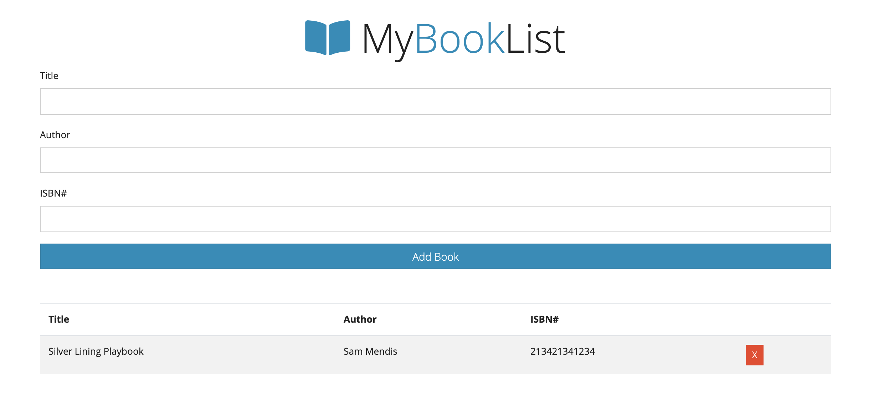

# Creating a book store app using OOP

You should have the following features in the bookly app:

- User can add a new book by adding the name, author and url of the image
- Once added the book will be marked not read
- You can change the state of the book to `Read` and it will be marked as completed
- User can delete the book

let button = document.querySelector('button');
class BookList{
    constructor(root,list=[]){
        this.root = root;
        this.books = list;
    }
    add(text){
        let book = new Book(text);
        this.books.push(book);
        this.createUI();
        return this.books.length;
        
    }
    createUI(){
        this.books.forEach((book)=>{
            this.root.append(book.createUI());
        });
    }
}

class Book{
    constructor(title,author,ISBN){
        this.title = title;
        this.author = author;
        this.ISBN = ISBN;
        this.id = `id-${Date.now()}`;
        this.isDone = false;
    }
    handleCheck(){
        this.isDone = !this.isDone;
        this.createUI();
    }
    showElements(){
       
        let title = document.getElementById('Title');
        title.innerText
    }
    createUI(){
        let li = document.createElement('li');
        let input = document.createElement('input');
        input.type = "checkbox";
        input.checked = this.isDone;
        input.addEventListener('click',this.handleCheck.bind(this));
        let p1 = document.createElement('p');
        p1.innerText = this.title;
        let p2 = document.createElement('p');
        p2.innerText = this.author;
        let p3 = document.createElement('p');
        p3.innerText = this.ISBN;
        let span = document.createElement('span');
        span.innerText = "X";
        span.style.color = "Red";
        li.append(input,p1,p2,p3,span);
        let div2 = document.querySelector("container2");
        div2.append(li);
        return li;
    }
}

let input1 = document.getElementById('Title');
let input2 = document.getElementById('Author');
let input3 = document.getElementById('ISBN#');

let myBook = new BookList(document.querySelector('.container2'));
myBook.add("hello");
button.addEventListener('click',myBook.createUI());